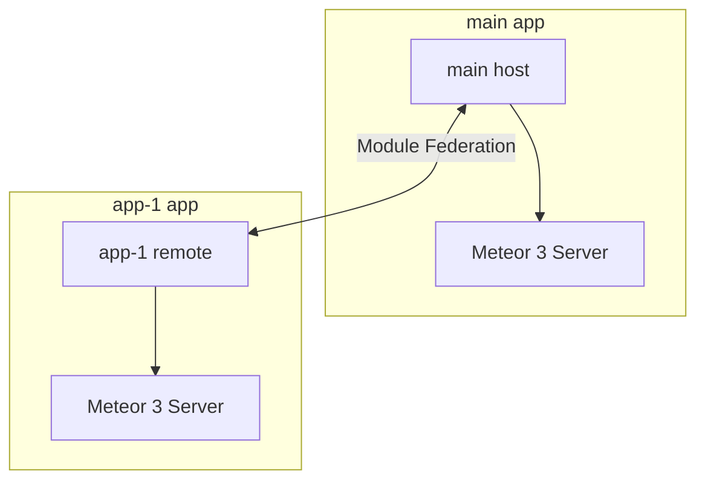

# Multi-App Accounts Workspace

A monorepo-style workspace featuring **Meteor.js 3**, **Vue 3**, and **Rspack** with integrated **Module Federation** to support multi-application accounts and micro-frontend structures.

---

## 📂 Repository Structure

The workspace contains two core applications running on Meteor 3.x and integrated with Vue 3 and modern build systems:

*   **[`main`](file:///Users/rabbit/Desktop/App/Test/multi-app-accounts/main)**: The primary host application.
    *   **Tech Stack**: Meteor 3.x, Vue 3, Rspack, Tailwind CSS v4, Vue Router, `@module-federation/enhanced`
    *   **Role**: Host / Shell application that orchestrates layout, authentication, and shares core services/state.
*   **[`app-1`](file:///Users/rabbit/Desktop/App/Test/multi-app-accounts/app-1)**: A remote micro-frontend.
    *   **Tech Stack**: Meteor 3.x, Vue 3, Rspack, Tailwind CSS v3, Vuex, Vue Router, `@module-federation/enhanced`
    *   **Role**: Sub-application / Remote module providing specific workspace features or account management panels.

---

## ⚡ Tech Stack & Architecture

This architecture leverages the high performance of **Rspack** (a fast Rust-based replacement for Webpack) along with Meteor's robust backend-to-frontend reactivity.



### Key Technical Decisions
*   **Rspack Bundling**: Significant reduction in build and hot-module replacement (HMR) times.
*   **Module Federation**: Enables runtime sharing of Vue components and store instances between `main` and `app-1`.
*   **Meteor 3.x**: Embracing modern Meteor development with asynchronous API patterns and improved performance.

---

## 🚀 Getting Started

To run either of the applications, make sure you have [Meteor](https://www.meteor.com/install) installed on your system.

### Running `main` (Host)

1.  Navigate to the `main` directory:
    ```bash
    cd main
    ```
2.  Install dependencies:
    ```bash
    meteor npm install
    ```
3.  Start the development server:
    ```bash
    meteor
    ```
    *   The app will run at `http://localhost:3000` (or the default port configured).

### Running `app-1` (Remote)

1.  Navigate to the `app-1` directory:
    ```bash
    cd app-1
    ```
2.  Install dependencies:
    ```bash
    meteor npm install
    ```
3.  Start the development server:
    ```bash
    meteor --port 3010
    ```
    *   The remote application runs on a separate port to prevent conflicts.

---

## 🛠 Configuration Details

### Module Federation Setup
Both applications configure `@module-federation/enhanced` inside their respective `rspack.config.js` files:
- `main` acts as the host consuming remotes and exposing shared dependencies (`vue`, `vue-router`, etc.).
- `app-1` acts as a remote exposing specific routes, components, or modules to be dynamically loaded by the host.

### Styling & CSS
- `main` uses **Tailwind CSS v4** configured with `@tailwindcss/postcss`.
- `app-1` uses **Tailwind CSS v3** configured with `autoprefixer` and `tailwind.config.js`.
