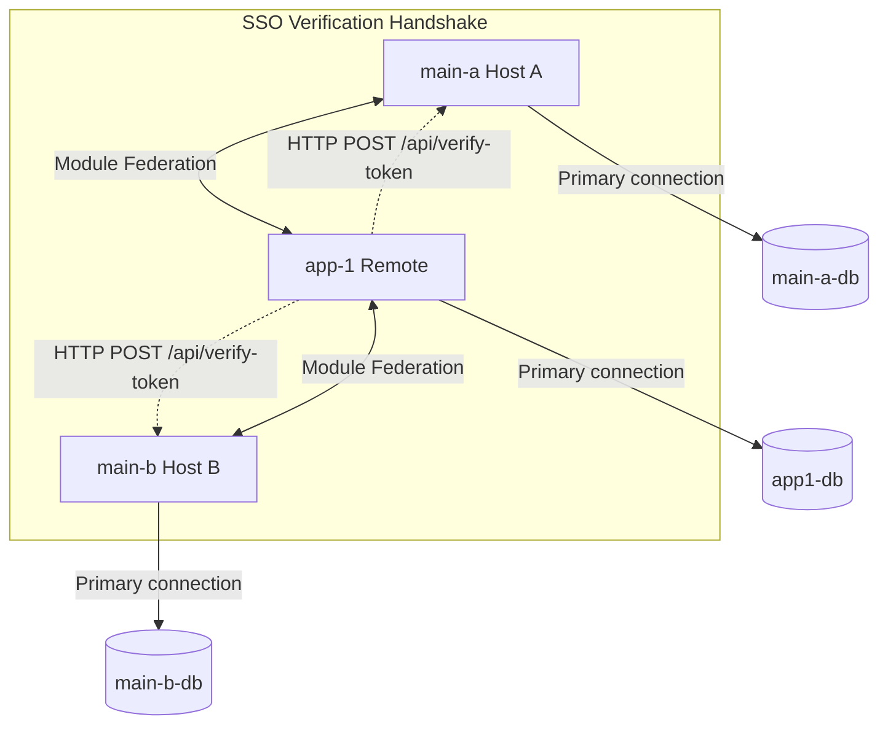

# Multi-App Accounts Workspace (Multi-Tenant Isolated Databases)

A monorepo-style workspace featuring **Meteor.js 3**, **Vue 3**, and **Rspack** with integrated **Module Federation** to support multi-application accounts and micro-frontend structures.

This workspace is configured for **Isolated Databases per Host (True Multi-Tenant Isolation)**. Each host and remote application runs on its own isolated MongoDB database, while maintaining Single Sign-On (SSO) using a secure HTTP token verification loop.

---

## 📂 Repository Structure

The workspace contains three core applications running on Meteor 3.x and integrated with Vue 3 and modern build systems:

- **[`main-a`](file:///Users/rabbit/Desktop/App/Test/multi-app-accounts/main-a)**: The primary host application A.
  - **Ports**: App Port `3000` | Rspack devServer Port `8080`
  - **Database**: `main-a-db`
- **[`main-b`](file:///Users/rabbit/Desktop/App/Test/multi-app-accounts/main-b)**: The secondary host application B.
  - **Ports**: App Port `3001` | Rspack devServer Port `8082`
  - **Database**: `main-b-db`
- **[`app-1`](file:///Users/rabbit/Desktop/App/Test/multi-app-accounts/app-1)**: A remote micro-frontend.
  - **Ports**: App Port `4000` | Rspack devServer Port `8081`
  - **Database**: `app1-db`

---

## ⚡ Tech Stack & Architecture

This architecture leverages the high performance of **Rspack** (a fast Rust-based replacement for Webpack) along with Meteor's robust backend-to-frontend reactivity and Module Federation for runtime sharing.



### Key Technical Implementations

- **Multi-Tenant SSO Handshake:** Because databases are isolated, `app-1`'s server cannot look up user login tokens in `main-a`'s or `main-b`'s database directly. Instead:
  1. The client passes `{ multiHostLogin: { token, origin } }` when connecting to `app-1`.
  2. `app-1`'s server intercepts the request and calls the issuing host's `/api/verify-token` HTTP endpoint.
  3. The host validates the token in its database and returns the profile.
  4. `app-1` automatically resolves or creates a local shadow tenant user in `app1-db`.
- **Rspack Port Isolation:** Uses the `RSPACK_DEVSERVER_PORT` environment variable in each app's `package.json` to allocate unique devServer ports (`8080`, `8081`, `8082`), avoiding `EADDRINUSE` conflicts when running concurrently.
- **Meteor Cache Ignoring:** Employs `.meteorignore` configurations to ignore Rspack cache outputs (`node_modules/.cache/`), preventing infinite compilation loops.

---

## 🚀 How to Use (Local Development)

To run the applications locally, ensure you have [Meteor](https://www.meteor.com/install) installed on your system.

### Running Locally (Concurrent Boot)

Start each application in a separate terminal:

#### 1. Run `app-1` (Remote)
```bash
cd app-1
meteor npm install
meteor npm run start
```
*Runs at `http://localhost:4000` (Rspack assets on `http://localhost:8081`)*

#### 2. Run `main-a` (Host A)
```bash
cd main-a
meteor npm install
meteor npm run start
```
*Runs at `http://localhost:3000` (Rspack assets on `http://localhost:8080`)*

#### 3. Run `main-b` (Host B)
```bash
cd main-b
meteor npm install
meteor npm run start
```
*Runs at `http://localhost:3001` (Rspack assets on `http://localhost:8082`)*

### 🧪 Verifying the Setup

1. Open `http://localhost:3000` (`main-a`) and `http://localhost:3001` (`main-b`) in separate tabs.
2. Sign in or register as `admin / 123456` in both.
3. Click on the **Remote Todo List** link in both tabs.
4. Add a Todo inside Host A. It will be saved inside `app-1`'s database under Host A's user namespace.
5. Notice that the Todo does **not** show up inside Host B's Todo List because they are separate user scopes and databases!

---

## 📦 How to Build (Production Bundling)

There are two ways to compile and package your applications for production:

### Option A: Manual Build (Meteor CLI)

You can build the applications manually using the Meteor CLI. In production, we compile static client bundles, which means we must specify the target host URLs at build-time so the bundler can generate the proper Module Federation mappings.

#### 1. Build `app-1` (Remote)
Set `PUBLIC_PATH` to the absolute URL where the remote static assets will be served (must end with a trailing slash `/`):
```bash
cd app-1
PUBLIC_PATH="https://app1-prod.example.com/" meteor build --directory ../output/app-1 --server-only
```

#### 2. Build `main-a` (Host A)
Set `REMOTE_APP1_URL` to point to `app-1`'s domain:
```bash
cd main-a
REMOTE_APP1_URL="https://app1-prod.example.com" meteor build --directory ../output/main-a --server-only
```

#### 3. Build `main-b` (Host B)
Set `REMOTE_APP1_URL` to point to `app-1`'s domain:
```bash
cd main-b
REMOTE_APP1_URL="https://app1-prod.example.com" meteor build --directory ../output/main-b --server-only
```

#### 4. Post-Build Setup (Installing Production Dependencies)
For each built bundle, navigate to its server programs folder and install production dependencies:
```bash
# Example for main-a
cd ../output/main-a/bundle/programs/server
npm install --production
```
To run the server, set your environment variables and start the node app:
```bash
PORT=3000 ROOT_URL=https://main-a.example.com MONGO_URL=mongodb://... node main.js
```

---

### Option B: Docker Compose Build (Containerized)

We provide a [docker-compose.yml](file:///Users/rabbit/Desktop/App/Test/multi-app-accounts/docker-compose.yml) file to automatically build container images and run them in containerized mode.

#### 1. Build and run all containers:
```bash
docker compose up --build -d
```
*This command triggers multi-stage builds inside each folder's Dockerfile, passing target arguments automatically, and starts a local MongoDB container.*

#### 2. Verify running services:
* MongoDB is running on `localhost:27017`
* `app-1` (Remote) is running on `http://localhost:4000`
* `main-a` (Host A) is running on `http://localhost:3000`
* `main-b` (Host B) is running on `http://localhost:3001`

#### 3. Shut down services:
```bash
docker compose down
```
---

### Option C: Manual Docker Build (Raw Docker CLI)

If you want to build and run the containers manually without Docker Compose:

#### 1. Build the Images
Set the build arguments for each folder:

- **Build `app-1` (Remote):**
  ```bash
  cd app-1
  docker build --build-arg PUBLIC_PATH="https://app1-prod.example.com/" -t multi-app-remote-app1 .
  ```
- **Build `main-a` (Host A):**
  ```bash
  cd ../main-a
  docker build --build-arg REMOTE_APP1_URL="https://app1-prod.example.com" -t multi-app-host-main-a .
  ```
- **Build `main-b` (Host B):**
  ```bash
  cd ../main-b
  docker build --build-arg REMOTE_APP1_URL="https://app1-prod.example.com" -t multi-app-host-main-b .
  ```

#### 2. Run the Containers
Ensure you pass the correct environment variables for isolated databases and host settings:

- **Run `app-1`:**
  ```bash
  docker run -d -p 4000:4000 \
    --name app1-container \
    -e ROOT_URL="https://app1-prod.example.com" \
    -e MONGO_URL="mongodb://<mongodb-ip>:27017/app1-db" \
    multi-app-remote-app1
  ```
- **Run `main-a`:**
  ```bash
  docker run -d -p 3000:3000 \
    --name main-a-container \
    -e ROOT_URL="https://main-a.example.com" \
    -e MONGO_URL="mongodb://<mongodb-ip>:27017/main-a-db" \
    -e METEOR_SETTINGS='{"public":{"app1ServerUrl":"https://app1-prod.example.com"}}' \
    multi-app-host-main-a
  ```
- **Run `main-b`:**
  ```bash
  docker run -d -p 3001:3000 \
    --name main-b-container \
    -e ROOT_URL="https://main-b.example.com" \
    -e MONGO_URL="mongodb://<mongodb-ip>:27017/main-b-db" \
    -e METEOR_SETTINGS='{"public":{"app1ServerUrl":"https://app1-prod.example.com"}}' \
    multi-app-host-main-b
  ```

---

## 🛠 Configuration Details

### Module Federation Setup

Host applications configure `@module-federation/enhanced` inside their respective `rspack.config.js` files:

- `main-a` and `main-b` act as hosts consuming remotes and exposing shared dependencies (`vue`, `vue-router`, etc.).
- `app-1` acts as a remote exposing specific routes, components, or modules to be dynamically loaded by the hosts.

### Cross-Application DDP Connections

Since remote components from `app-1` are rendered inside the host shells, calls to Meteor methods in those components must be routed back to their respective remote backend server.
* This is automated via the `getRemoteConnection(remoteName, defaultPort)` utility helper (located in `imports/ui/utils/ddp.js` for all applications).
* It automatically detects if it's running inside the standalone remote or consuming host shell, and returns the appropriate client connection (reusing native `Meteor` or creating a DDP connection dynamically).

---

## 🔄 How to Upgrade a Project to Module Federation

If you want to migrate a standard Meteor + Vue 3 + Rspack project to utilize Module Federation, follow this step-by-step integration blueprint:

### 1. Install Dev Dependencies
Install the required module federation compilation dependencies on **both** the host and remote projects:
```bash
meteor npm install --save-dev @module-federation/enhanced
```

### 2. Create the Async Boot Boundary (Host & Remote)
Module Federation needs to load shared modules (like Vue) asynchronously *before* the application bootstraps. To allow this, you must introduce an asynchronous import boundary at your client entry point:

1. **Move Boot Code:** Move your actual Vue app creation logic out of your main client entry file (e.g. `client/main.js`) into an imported file (e.g. `imports/ui/main.js`).
2. **Dynamic Entry:** Replace your client entry file (`client/main.js`) with a single dynamic import:
   ```javascript
   // client/main.js
   import('../imports/ui/main');
   ```

---

### 3. Configure the Remote Application (The Exporter)
The remote application compiles assets and exposes routes, components, or stores.

#### Modify `rspack.config.js`
Update the remote configuration in [app-1 rspack.config.js](file:///Users/rabbit/Desktop/App/Test/multi-app-accounts/app-1/rspack.config.js):

1. **Set `output.uniqueName` & `output.publicPath`:**
   ```javascript
   output: {
     uniqueName: "app1", // Must be unique across all remotes
     publicPath: process.env.PUBLIC_PATH || (Meteor.isProduction ? "auto" : "http://localhost:8081/"),
   }
   ```
2. **Configure devServer CORS:** The host browser will download Javascript chunks from the remote. Enable cross-origin headers in development:
   ```javascript
   devServer: {
     headers: {
       "Access-Control-Allow-Origin": "*",
     }
   }
   ```
3. **Import and Register the Module Federation Plugin:**
   ```javascript
   const { ModuleFederationPlugin } = require("@module-federation/enhanced/rspack");

   // Under plugins array:
   new ModuleFederationPlugin({
     name: "app1", // Remote name referenced by the host
     filename: "remoteEntry.js",
     exposes: {
       "./router": "./imports/ui/router.js", // Key-value pair of exposed files
     },
     shared: {
       vue: { singleton: true, requiredVersion: "^3.3.9", eager: true },
       "vue-router": { singleton: true, requiredVersion: "^4.2.5", eager: true }
     }
   })
   ```

---

### 4. Configure the Host Application (The Consumer)
The host application downloads the exposed scripts and stitches the modules together.

#### Modify `rspack.config.js`
Update the host configuration in [main-a rspack.config.js](file:///Users/rabbit/Desktop/App/Test/multi-app-accounts/main-a/rspack.config.js):

1. **Set unique name:**
   ```javascript
   output: {
     uniqueName: "main_a",
   }
   ```
2. **Register the remotes and plugins:**
   ```javascript
   const { ModuleFederationPlugin } = require("@module-federation/enhanced/rspack");

   new ModuleFederationPlugin({
     name: "main_a",
     filename: "remoteEntry.js",
     remotes: {
       // Format: name@url/remoteEntry.js
       app1: "app1@http://localhost:8081/remoteEntry.js",
     },
     shared: {
       vue: { singleton: true, requiredVersion: "^3.3.9" },
       "vue-router": { singleton: true, requiredVersion: "^4.2.5" }
     }
   })
   ```

---

### 5. Mount Remote Modules inside the Host Shell
Once federation is active, you can import exposed elements from the remote using standard ESM imports:

#### Route Aggregation Example (`main-a/imports/ui/router.js`):
```javascript
import { createRouter, createWebHistory } from "vue-router";
import Home from "./views/Home.vue";

// 1. Import exposed modules from 'app1' alias
import { routes as remoteRoutes } from "app1/router";

export const router = createRouter({
  history: createWebHistory(),
  routes: [
    { path: "/", name: "home", component: Home },
    // 2. Append remote views dynamically
    ...remoteRoutes.map((route) => ({
      path: `/remote${route.path === "/" ? "" : route.path}`,
      name: `remote-${route.name}`,
      component: route.component,
    })),
  ],
});
```

