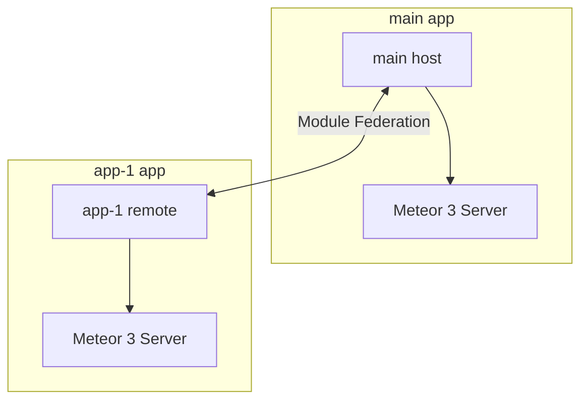

# Multi-App Accounts Workspace

A monorepo-style workspace featuring **Meteor.js 3**, **Vue 3**, and **Rspack** with integrated **Module Federation** to support multi-application accounts and micro-frontend structures.

---

## 📂 Repository Structure

The workspace contains two core applications running on Meteor 3.x and integrated with Vue 3 and modern build systems:

- **[`main`](file:///Users/rabbit/Desktop/App/Test/multi-app-accounts/main)**: The primary host application.
  - **Tech Stack**: Meteor 3.x, Vue 3, Rspack, Tailwind CSS v4, Vue Router, `@module-federation/enhanced`
  - **Role**: Host / Shell application that orchestrates layout, authentication, and shares core services/state.
- **[`app-1`](file:///Users/rabbit/Desktop/App/Test/multi-app-accounts/app-1)**: A remote micro-frontend.
  - **Tech Stack**: Meteor 3.x, Vue 3, Rspack, Tailwind CSS v3, Vuex, Vue Router, `@module-federation/enhanced`
  - **Role**: Sub-application / Remote module providing specific workspace features or account management panels.

---

## ⚡ Tech Stack & Architecture

This architecture leverages the high performance of **Rspack** (a fast Rust-based replacement for Webpack) along with Meteor's robust backend-to-frontend reactivity.



### Key Technical Decisions

- **Rspack Bundling**: Significant reduction in build and hot-module replacement (HMR) times.
- **Module Federation**: Enables runtime sharing of Vue components and store instances between `main` and `app-1`.
- **Meteor 3.x**: Embracing modern Meteor development with asynchronous API patterns and improved performance.

---

## 🚀 Getting Started

To run either of the applications, make sure you have [Meteor](https://www.meteor.com/install) installed on your system.

### Running `main` (Host)

1.  Navigate to the `main` directory:
    ```bash
    cd main
    ```
2.  Install dependencies:
    ```bash
    meteor npm install
    ```
3.  Start the development server:

    ```bash
    meteor
    ```

    - The app will run at `http://localhost:3000` (or the default port configured).

### Running `app-1` (Remote)

1.  Navigate to the `app-1` directory:
    ```bash
    cd app-1
    ```
2.  Install dependencies:
    ```bash
    meteor npm install
    ```
3.  Start the development server:

    ```bash
    meteor --port 4000
    ```

    - The remote application runs on a separate port to prevent conflicts.

---

## 🛠 Configuration Details

### Module Federation Setup

Both applications configure `@module-federation/enhanced` inside their respective `rspack.config.js` files:

- `main` acts as the host consuming remotes and exposing shared dependencies (`vue`, `vue-router`, etc.).
- `app-1` acts as a remote exposing specific routes, components, or modules to be dynamically loaded by the host.

### Styling & CSS

- `main` uses **Tailwind CSS v4** configured with `@tailwindcss/postcss`.
- `app-1` uses **Tailwind CSS v3** configured with `autoprefixer` and `tailwind.config.js`.

---

## ⚠️ Important Integration Notes

### 1. Tailwind CSS Class Compilation (Host Scanning)
Because Tailwind compiles utility classes on-demand based on source files, utility classes used in `app-1`'s remote components but **not** in `main`'s code would normally be missing in the host build.
*   **Solution**: The host's CSS file `main/imports/ui/main.css` includes a wildcard `@source` directive pointing to all remote app directories:
    ```css
    @source "../../../app-*/imports/**/*.{vue,js,ts,jsx,tsx}";
    ```
*   This pattern ensures that any new remote added (e.g., `app-2`, `app-3`) will automatically have its styling scanned by the host CSS compiler.

### 2. Port & Host Settings
For Module Federation and data synchronization to work correctly:
*   **Main App**: Runs on port `3000`.
*   **App 1**: Runs on port `4000`.
*   **App 1 Assets / Module Federation Entry**: Served by Rspack on port `8081` (`http://localhost:8081/remoteEntry.js`).
*   Ensure both applications are running concurrently during development.

### 3. Cross-Application DDP Connections
Since remote components from `app-1` (or future remotes) are rendered inside the host shell (`main`), calls to Meteor methods in those components must be routed back to their respective remote backend server.
*   This is automated via the `getRemoteConnection(remoteName, defaultPort)` utility helper (located in `imports/ui/utils/ddp.js` for both applications).
*   It automatically detects if it's running inside the standalone remote or consuming host shell, and returns the appropriate client connection (reusing native `Meteor` or creating a DDP connection dynamically).


---

## 📦 Production & Release Checklist

Before releasing to production, make sure you configure and verify the following settings:

### 1. Build Environment Variables

During the bundle/build process (`meteor build`), ensure you provide the correct production URLs:

- **For `app-1` (Remote)**:
  Set the `PUBLIC_PATH` to the absolute URL where `app-1` assets are served (must end with `/`):
  ```bash
  PUBLIC_PATH="https://app-1-prod.example.com/"
  ```
- **For `main` (Host)**:
  Set `REMOTE_APP1_URL` to point to the `app-1` domain:
  ```bash
  REMOTE_APP1_URL="https://app-1-prod.example.com"
  ```

### 2. Meteor Settings (`settings.json`)

Configure your production settings (e.g. `settings-prod.json`) for the host and remote clients:

- Specify the remote DDP server URL inside `public.remoteServerUrl`:
  ```json
  {
    "public": {
      "remoteServerUrl": "https://app-1-prod.example.com"
    }
  }
  ```
- Launch Meteor with the `--settings` flag or set the `METEOR_SETTINGS` environment variable.

### 3. CORS Configuration

Because the host application (`main`) downloads JavaScript chunks dynamically from `app-1`'s host, the remote server serving `app-1`'s static assets **must** allow cross-origin requests:

- Add CORS headers for static files (particularly `remoteEntry.js` and JS/CSS chunks):
  ```http
  Access-Control-Allow-Origin: https://main-prod.example.com (or "*" with authentication/safety review)
  Access-Control-Allow-Methods: GET, OPTIONS
  ```

### 4. Sticky Sessions on Load Balancer
*   Meteor's reactive DDP protocol uses WebSockets and fallback polling. If deploying behind a load balancer (e.g., Nginx, AWS ALB), make sure **sticky sessions (session affinity)** is enabled.

---

## 🐳 Containerization with Docker

Both applications feature multi-stage `Dockerfile` configurations targeting Node 22 (matching Meteor 3.x requirements):
*   **Host Dockerfile**: [main/Dockerfile](file:///Users/rabbit/Desktop/App/Test/multi-app-accounts/main/Dockerfile)
*   **Remote Dockerfile**: [app-1/Dockerfile](file:///Users/rabbit/Desktop/App/Test/multi-app-accounts/app-1/Dockerfile)

### Build & Run with Docker Compose (Recommended)
We provide a [docker-compose.yml](file:///Users/rabbit/Desktop/App/Test/multi-app-accounts/docker-compose.yml) file to build and run all services (including a MongoDB database) locally with a single command.

1.  **Build and start all services**:
    ```bash
    docker compose up --build -d
    ```
2.  **Verify running services**:
    *   MongoDB is running on `localhost:27017`
    *   `app-1` (Remote) is running on `http://localhost:4000` (serving its own Module Federation assets)
    *   `main` (Host) is running on `http://localhost:3000`
3.  **Shut down services**:
    ```bash
    docker compose down
    ```

### Build & Run Manually with Docker
If you want to build and run the containers manually:

#### Option A: Deployment using Domain Names

1.  **Build and run the Remote App (`app-1`)**:
    ```bash
    cd app-1
    docker build --build-arg PUBLIC_PATH="https://app-1-prod.example.com/" -t multi-app-remote .
    docker run -d -p 4000:4000 \
      -e ROOT_URL="https://app-1-prod.example.com" \
      -e MONGO_URL="mongodb://..." \
      -e METEOR_SETTINGS='{"public":{"remoteServerUrl":"https://app-1-prod.example.com"}}' \
      multi-app-remote
    ```

2.  **Build and run the Host App (`main`)**:
    ```bash
    cd main
    docker build --build-arg REMOTE_APP1_URL="https://app-1-prod.example.com" -t multi-app-host .
    docker run -d -p 3000:3000 \
      -e ROOT_URL="https://main-prod.example.com" \
      -e MONGO_URL="mongodb://..." \
      -e METEOR_SETTINGS='{"public":{"remoteServerUrl":"https://app-1-prod.example.com"}}' \
      multi-app-host
    ```

#### Option B: Deployment using an IP Address (e.g., `192.168.0.220`)

When deploying directly using an IP address and ports (e.g., Remote on port `4000` and Host on port `3000`), make sure `PUBLIC_PATH` includes the port and ends with a **trailing slash** (`/`):

1.  **Build and run the Remote App (`app-1`)**:
    ```bash
    cd app-1
    docker build --build-arg PUBLIC_PATH="http://192.168.0.220:4000/" -t multi-app-remote .
    docker run -d -p 4000:4000 \
      -e ROOT_URL="http://192.168.0.220:4000" \
      -e MONGO_URL="mongodb://..." \
      -e METEOR_SETTINGS='{"public":{"remoteServerUrl":"http://192.168.0.220:4000"}}' \
      multi-app-remote
    ```

2.  **Build and run the Host App (`main`)**:
    ```bash
    cd main
    docker build --build-arg REMOTE_APP1_URL="http://192.168.0.220:4000" -t multi-app-host .
    docker run -d -p 3000:3000 \
      -e ROOT_URL="http://192.168.0.220:3000" \
      -e MONGO_URL="mongodb://..." \
      -e METEOR_SETTINGS='{"public":{"remoteServerUrl":"http://192.168.0.220:4000"}}' \
      multi-app-host
    ```


---

## 🤖 Automated Deployment with Ansible

The workspace includes a production Ansible Playbook ([deploy.yml](file:///Users/rabbit/Desktop/App/Test/multi-app-accounts/deploy.yml)) that automates:
1. Pulling your latest source code from Git onto the target server.
2. Building Docker images using correct build-time arguments (`PUBLIC_PATH` and `REMOTE_APP1_URL`).
3. Running containers with specified port mappings, network routing, and environment variables.

### How to Run the Playbook

1.  **Configure hosts**: Create an inventory file `hosts.ini` pointing to your web server:
    ```ini
    [webservers]
    your-server-ip ansible_user=ubuntu ansible_ssh_private_key_file=~/.ssh/id_rsa
    ```
2.  **Configure variables**: Update the default values inside `vars:` section in [deploy.yml](file:///Users/rabbit/Desktop/App/Test/multi-app-accounts/deploy.yml) (e.g., repository URL, domains, and database credentials).
3.  **Run the playbook**:
    ```bash
    ansible-playbook -i hosts.ini deploy.yml
    ```

